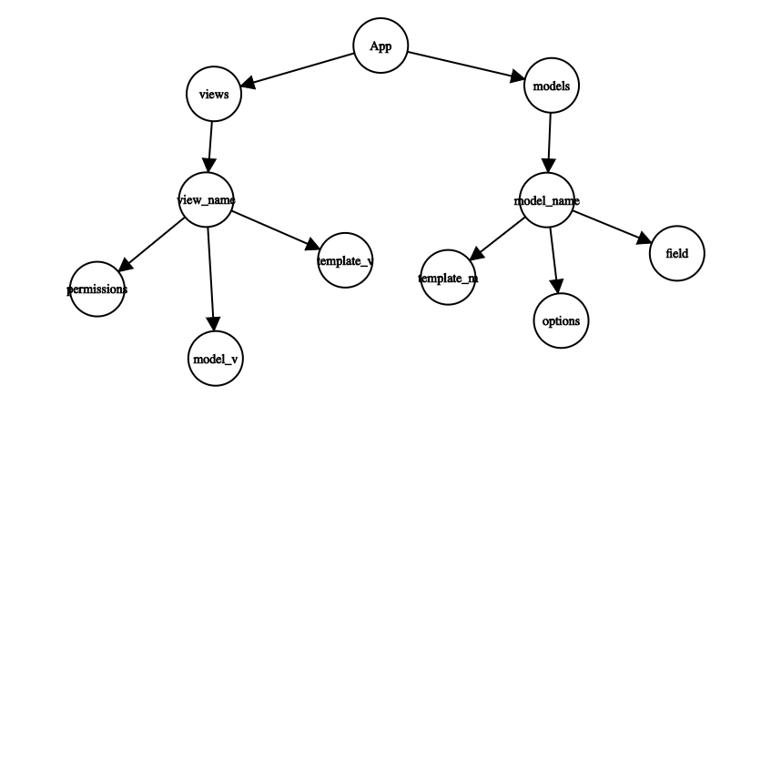

# FastDJ란?

FastDJ란 rest api 서버로서 django 프로젝트를 좀 더 쉽게 생성할 수 있게 해주는 스크립트 입니다. 대부분의 사람들이 djangorestframework로 하는 작업은 생각보다 많은 종류가 아닙니다. FastDJ는 이러한 것들을 template으로서 제공하고, 설정파일을 조금 수정함으로써 사용 할 수 있습니다. python3 이후, 그리고 django 2 이후 버전부터 사용 할 수 있습니다.

# FastDJ로 할 수 있는것

- 모델 만들기
- 가상환경(virtualenv) 설정
- 필요한 모듈 자동 설치 (django, djangorestframework, django-cors-headers)
- settings.py에 있는 내용을 더 쉽게 설정 ( Timezone, django_apps에 앱 추가, restframework 설정과 cors-headers 설정 )
- serializer 설정
- 템플릿을 통한 커스텀 유저 생성
- 몇가지의 view 템플릿
- 자동 url 라우팅

# 제가 필수로 써야 할까요?

구현하고자 하는 내용이 파이썬 코드상 복잡한 로직이라면, 이 스크립트는 최선의 답이 아닐 수 있습니다. 하지만 105줄 만으로 커뮤니티의 백엔드를 구현한 예제가 있으니, examples 폴더에서 확인해보세요!

# 사용법

## 프로젝트 스펙 작성

일단, 예제 파일인 examples/prj_info.py를 쪼개서 보며 fastdj의 사용법을 이해 해 봅시다.

실제로 여러분이 프로젝트를 생성 할 때에는,

```
project_name = "community"  # snake_case suggested
```

먼저, project_name의 이름을 정함으로서 프로젝트의 이름을 설정해주시고,

## 사용자 모델

```
user_model = {
    "token_auth": True,  # set to use token auth to authenticate
    "allow_register": True,  # set to use auto-craeted register function
    "set_visibility_public": True,
    "fields":
    {
        "nickname": {
            "field": "CharField",
            "options": ["max_length=10"]
        },
        "bio": {
            "field": "TextField",
            "options": []
        },
        "website": {
            "field": "URLField",
            "options": []
        },
        "job": {
            "field":
            "CharField",
            "choices": [("ST", "STUDENT"), ("BS", "BUSINESS MAN"),
                        ("PR", "PROGRAMMER"), ("ETC", "ETC")],
            "options": ["max_length=3", "default='ETC'"]
        }
    }
}
```

user_model 부분인데요, 여기서는 설정해야 할 것이 네가지가 있습니다. token을 반환하는 라우트를 넣어 이 token을 로그인을 하는데 활용하고싶으면, token_auth를 True로 해두세요. 마찬가지로 회원가입을 허용하려면 allow_register을 True로 해두시고요, set_visibility는 어떤 한 사람의 프로필을 그 유저 외에도 다른 사람이 조회 할 수 있게 하려면 True로 하면됩니다. 예제 파일에서는 커뮤니티를 만드는것이 목적이기에 True로 진행했어요. 그 다음에는 fields에요. 이는 뒤에서 다룰 app 파트에서도 나올 내용인데요. 유저와 관련하여 저장하고자 하는 데이터들을 이곳에 적어두면되는데, 다음의 양식을 지켜서 적어주면 됩니다.

```
    <저장하고자 하는 데이터의 이름>: {
            "field": <저장하고자 하는 데이터의 타입>,
            "options": [<지정하고자 하는 옵션들>]
        },
```

field와 option의 경우에는, https://docs.djangoproject.com/en/2.2/ref/models/fields/ 에서 어떠한 필드들이 사용 가능한지 확인 할 수 있어요. nickname필드를 예시로 보자면,

```
        "nickname": {
            "field": "CharField",
            "options": ["max_length=10"]
        },
```

저장하고자 하는 내용이 CharField타입이고, 최대 길이를 option으로 지정해주어야하는 특성에 따라 "max_length=10"으로 지정해주었어요. 만약 지정해야 할 옵션이 여러가지이면,

```
    "job": {
            "field":
            "CharField",
            "choices": [("ST", "STUDENT"), ("BS", "BUSINESS MAN"),
                        ("PR", "PROGRAMMER"), ("ETC", "ETC")],
            "options": ["max_length=3", "default='ETC'"]
        }
```

와 같이 options에 여러가지를 넣을 수도 있답니다. 그리고, choices는 무엇인지 궁금할텐데요, 이는 만약 CharField에 선택지를 제한해서 특정 내용만 들어가게 하고싶은 경우에 사용하면 됩니다. 그러니까 다음과 같은 상황이 있다고 쳐볼게요. 최종학력: {초등학교, 중학교, 고등학교, 학사, 석사, 박사} 와 같은 것 중 하나를 고르게 하고, 이것들중의 하나만 DB에 저장을 하고싶다면 이때 CharField와 같이 choices를 사용하면 됩니다.

자, 수고하셨습니다. 이제 사용자의 데이터를 담당하는 모델과 그에 해당하는 기능(회원가입, 사용자 프로필 조회, 토큰을 통한 로그인)을 만든거에요. 기존의 Django와 비교했을때는 먼저 모델을 생성하고, 그에 해당하는 시리얼라이저를 만든 뒤에, 원하는 내용을 직접 하나하나(회원가입, 프로필 조회 등) 구현하고, 이를 admin파일을 통해 내가 만든 사용자 모델을 사용하겠다고 설정 한 뒤, 만든 기능들을 하나하나 url에 맞게 맞춰줘야(라우팅) 했지만, 우리는 약 26줄만에 이 모든 내용을 끝냈습니다.

## App

다음은 app을 볼거에요.

```python
apps = {
    "article": {
        "models": {
            "Article":{
                "writer": {
                    "template": "model_owner"
                },
                "content": {
                    "field": "TextField",
                    "options": ["null=False", "blank=True"]
                },
                "tag": {
                    "field": "TextField",
                    "options": ['default=""']
                },
            },
        },
        "views": {
            "PostDetail": {
                "template": "detail_view_ud",
                "model": "Article",
                "permissions": "IsOwnerOrReadOnly"
            },
            "PostList": {
                "template": "all_objects_view",
                "model": "Article",
                "permissions": "IsAuthenticatedOrReadOnly"
            },
            "my_posts_view": {
                "template": "filter_objects_view",
                "model": "Article",
                "options": ["writer=request.user"]
            },
            "user_posts_view": {
                "template": "filter_objects_view",
                "model": "Article",
                "url_getters": "username",
                "options": ["writer=username"]
            }
        }
    }
```

이건 app의 일부 인데요. 게시글과 관련한 내용이 모두 들어있는 코드랍니다. 먼저, app 바로 밑에 있는 dictionary를 볼게요. "article" 이라는 딕셔너리 밑에 다른 딕셔너리가 있는 구조이죠? 모든 app안에 있는 딕셔너리는 다음과 같은 구조를 가져요. 

view_name이나 model_name은 아까 보았던것처럼 이름그대로 뷰나 모델의 이름이기 때문에 기능을 잘 나타낼 수 있는 방식으로 이름을 지어주면 좋고, 그 다음은 아까 위에서도 보았던 model에 대해 상세히 설명하도록 할게요.

### 모델

먼저, 모델부터 이야기를 해볼까요? 모델은 다음과 같은 형태로 이루어져 있습니다.

```python
            <모델 이름>:{
                <필드 이름>: {
                    "template": <템플릿 명>, # 필요에 따라 없어도 됨
                    "field": <저장할 데이터의 타입>,
                    "options": <옵션>
                },
            },
```

template이라는 항목에 대해 설명하겠습니다. 현재로서는 model_owner 항목밖에 들어가지 않을텐데요, 이 템플릿이 사용되는 경우는 단 하나 입니다. 만약 특정 모델안의 데이터에 소유주를 지정하고 싶을때 사용하는것인데요, 그러니까... 우리의 예시 파일에서는 커뮤니티를 만든다고 하였죠? 그러니 DB에 저장될 데이터는 게시글, 덧글과 같은 것들이 있을거에요. 그런데 이 게시글이 누가 작성한것인지(누구의 소유인지) 기록이 되기를 바란다면, 이때 model_owner 템플릿을 사용하는거에요. model_owner 이라는 템플릿을 작성하게 되면, 사실 내부적으로는 다음과 같이 변환되어 작동합니다.

```python
"field": "ForeignKey",
"options": [
                "'auth.user'", f"related_name='{self.app_name}_{field_name}'",
                "on_delete=models.CASCADE", "null=False"
            ]
```

네, ForeignKey라는 필드의 이름으로 사용자 모델이 저장이 됩니다. Django를 사용 할 줄 아시는 분이라면 좀 더 친숙하게 이해가 가겠네요. 이해가 가지 않아도 좋습니다. 그저 소유자를 저장하고싶을때는 template: "model_owner"를 잊지 말아주세요! 그 다음엔 field와 option인데, 아까 유저모델에서도 다루었듯, field에는 저장할 데이터의 타입을 지정해주면 되고, 옵션은 내가 지정하고자 하는 내용을 적으면 됩니다. https://docs.djangoproject.com/en/2.2/ref/models/fields/ 이곳을 참고하여 더 많은 내용을 적어주시면 됩니다.

### 뷰

그 다음으로 다룰 내용은 뷰에요. 뷰는 다음과 같은 형태로 이루어져있답니다.

```python
<뷰 이름>: {
    "template": <템플릿 명>,
    "model": <대상으로 할 모델의 이름>,
    "options": <뷰에서 사용 할 옵션>,
    "url_getters": <url 요청을 할때 받을 파라미터>,
    "permissions": <이 뷰를 사용할 수 있는 권한 설정>
},
```

자, 뷰는 총 6개의 항목으로 이루어져있어요. template, model, options, url_getters, owner_field_name, permissions. 그런데 사실 이 6개가 동시에 사용되는 경우는 거의 없을거에요. 뷰의 경우는 먼저 템플릿을 고른 뒤, 그에 대한 옵션 (model, options, url_getters, owner_field_name, permissions)을 설정하는 방식으로 작동해요.

#### Template

template 안에는 다음과 같은 값들이 들어 갈 수 있어요.

```python
"detail_view"
"detail_view_u"
"detail_view_d"
"detail_view_ud"
"all_objects_view"
"filter_objects_view"
```

#### detail_view 시리즈 (GET, PATCH, DELETE)

detail_view 시리즈는 다음과 같은 기능을 해요.

> "하나의 데이터를 읽고, 수정하고, 삭제한다"

CRUD라는 단어를 들어보셨을지 모르겠는데, CRUD는 Create, Read, Update, Delete의 약자에요. 그러니까, detail_view는 RUD 를 담당하는 녀석이라고 볼 수 있죠.

예시에서 사용한 커뮤니티를 예시로 들어보겠습니다. 하나의 작성된 게시글을 읽고(조회), 수정하고, 삭제하는것은 이 RUD에 해당되는것이죠.

detail_view는 R만을 담당하고, detail_view_u는 RU, detail_view_d 는 RD, detail_view_ud 는 RUD를 담당하니 구현하고자 하는 내용에 따라 권한 설정을 해 주면 됩니다.

이 template을 사용하기 위해서는 다음과 같은 내용들이 지정되어있어야 해요.

```python
"model": <사용하고자 하는 DB 모델>,
"permissions": <권한>
```

model의 경우에는 다루고자 하는 데이터가 어떤 모델에 저장이 될지를 적어두는 곳이고, owner_field_name은 model_owner로 지정한 필드의 이름을 적어두면 됩니다. 그리고 나서는 이 뷰에 사용권한을 지정하는것이죠. 그러니까 다음과 같아요. 밑에 있는 코드는 detail_view_ud를 활용하는, 게시글 하나를 조회하고 수정하고 삭제할 수 있는 뷰의 예시에요.

```python
"PostDetail": {
                "template": "detail_view_ud",
                "model": "Article",
                "permissions": "IsOwnerOrReadOnly"
}
```

Article 모델에 게시글들이 저장되어있기에 이를 model로 설정해 주었고, 작성자가 아니면 읽기만 가능하도록 권한을 설정하였어요. permissions 안에 넣을 내용은 https://www.django-rest-framework.org/api-guide/permissions/#api-reference 에서 제공하는 내용과 더불어서, FastDJ가 제공하는 IsOwnerReadOnly도 있습니다! 이에 관한 내용은 업데이트 될 때 마다 추가 될 예정입니다.

#### all_objects_view (GET, POST)

all_objects_view는 위에서 말한 C와 R을 담당하는 녀석이에요.

> "하나의 모델에 있는 하나의 데이터를 생성하고, 여러개의 데이터 리스트를 읽는다"

마찬가지로 커뮤니티를 예시로 들어볼까요? 게시글을 업로드하고(생성하고), 작성된 게시글의 리스트를 읽는(조회하는) 걸 담당한다고 볼 수 있겠습니다. 밑에 있는 코드는, all_objects_view를 활용하는, 게시글들의 리스트를 조회하고 새 게시글을 생성 할 수 있는 뷰의 예시에요.

```python
"PostList": {
                "template": "all_objects_view",
                "model": "Article",
                "permissions": "IsAuthenticatedOrReadOnly"
}
```

마찬가지로 permissions안에 넣을 내용은 https://www.django-rest-framework.org/api-guide/permissions/#api-reference 에서 제공하는 내용과 더불어서, FastDJ가 제공하는 IsOwnerReadOnly도 있습니다! 이에 관한 내용은 업데이트 될 때 마다 추가 될 예정입니다.

##### 엥?

그런데 이상할거에요. 왜 CRUD를 분리해서 두었는지. 이는 뒤에서 설명할 라우팅에서 한번 더 다루겠지만, detail_view 시리즈의 url은 다음과 같이 매칭이 될거에요.

> address/app_name/id/

반면, all_objects_view 시리즈에서는 다음과 같이 매칭이 됩니다.

> address/app_name/

자, 게시글을 작성하려고 하는데 id는 자동으로 서버에서 지정되어 db에 들어가야 하겠죠? 그리고 여러개의 게시글들을 한번에 조회하려하는데 이에 가장 좋은 방법은 당연히 id 없이 요청을 때리는것이겠고요.

#### filter_objects_view (GET)

filter_objects_view는 다음과 같이 이해하면 편할 것 같아요.

> 특정 object에서 원하는것만 걸러서(filter) 읽는다.

위에서 그랬던것 처럼, 이번에도 커뮤니티를 예시로 들자면... 특정 유저가 작성한 게시글을 검색하는 기능을 만들때, 이 템플릿을 사용하면 되겠죠. 다음은 그 기능을 담당하는 코드입니다.

```
"user_posts_view": {
                "template": "filter_objects_view",
                "model": "Article",
                "url_getters": "username",
                "options": ["writer=username"]
}
```

url_getters는, 요청시에 인자값으로 받을 내용을 정할 수 있는 옵션입니다. 그리고 밑에있는 options에다가 옵션으로 writer=username을 주었죠. 이는 writer가 username과 같은것을 걸러서(filter) 조회 할 수 있게 반환해주는 템플릿입니다. 만약, 내가 작성한 게시글들을 반환하는 코드를 짜고 싶다면, 다음과 같이 짤 수 있겠죠.

```
"my_posts_view": {
                "template": "filter_objects_view",
                "model": "Article",
                "options": ["writer=request.user"]
}
```

request.user는 리퀘스트를 보낸 사람의 user 모델을 의미해요. 그렇기 때문에 요청자가 작성한 게시글을 조회 할 수 있게 하는 뷰는 위와 같은 코드가 될 수 있는 것이죠.

### 정리

놀랍게도, 이게 끝입니다! 먼저 적절한 template을 고른 뒤, 대상 model을 정하고, 필요에 따라 https://www.django-rest-framework.org/api-guide/permissions/#api-reference 를 참고하여 권한을 설정 한 뒤, 마찬가지로 필요에따라 url_getters나 option과 같은 내용들을 설정해주면 이제 뷰는 끝입니다.

## 라우팅

이제, 이러한 내용들을 url에 연결을 해야하겠죠. 이를 보통 라우팅(routing)이라고 부릅니다. 그런데 놀랍게도 FastDJ는 이러한 라우팅을 자동으로 진행 해 줍니다. 아까, 우리가 정해왔던 템플릿과 뷰의 이름으로 일정 규칙에 의해 자동으로 라우팅이 되는데요. 이 단락에서는 그 규칙에 대해 설명 하고자 합니다.

밑에있는 코드를 예시로 설명해볼게요.

```
"views": {
            "PostDetail": {
                "template": "detail_view_ud",
                "model": "Article",
                "permissions": "IsOwnerOrReadOnly"
            },
            "PostList": {
                "template": "all_objects_view",
                "model": "Article",
                "permissions": "IsAuthenticatedOrReadOnly"
            },
            "user_posts_view": {
                "template": "filter_objects_view",
                "model": "Article",
                "url_getters": "username",
                "options": ["writer=username"]
            }
        }
```

#### detail_view 시리즈

detail_view 시리즈를 사용한 PostDetail 뷰를 예시로 보죠.

> address/app_name/object_id/

와 같은 방식으로 생성이 됩니다. 그러니까, 하나의 게시글에 RUD를 담당하는 다음과 같은 코드의 PostDetail 뷰는

다음과 같이 라우팅이 되겠죠.

> address/article/object_id/

그러니까, object_id에 게시글의 id를 넣으면 해당 게시글을 로드하겠죠? 이 라우트로 GET 요청을 보내면 조회가 될것이고, PATCH요청을 보내면 수정이 될것이고, DELETE 요청을 보내면 삭제가 되겠죠. 만약 RUD 옵션이 모두 활성화 되었다면 말이지요.

#### all_objects_view

all_objects_view를 사용한 PostList의 경우로 설명해드리죠.

> address/article/

이 라우트에 GET 요청을 보내면 게시글의 모든 리스트가 반환 될 것이고, POST요청을 보내면 새 게시글을 작성 할 수 있겠죠.

#### filter_objects_view

마찬가지로 filter_objects_view를 사용한 user_posts_view를 예시로 들어볼게요.

> address/user_posts_view/

이 라우트에 요청을 보내면 해당 뷰를 사용 할 수 있겠죠. 즉, filter_objects_view에서는 지정한 이름 그대로 라우팅이 됩니다.

아, 그런데 url_getters로 받은 내용은 어떻게 주나 궁금하실 텐데요. filter_objects_view는 GET 방식을 사용하는 뷰이니, 다음과 같은 방식으로 넘겨주면 됩니다.

> address/user_posts_view/?username=유저이름

자, 축하드립니다! 이제 프로젝트의 스펙파일을 모두 작성하였어요. 이제 다음과 같은 방식으로 진행하면 프로젝트가 설정될 것입니다.

## settings.py

```python
timezone = "Asia/Seoul"
language = 'ko-kr'
```

마지막으로 timezone과 language에 대해 다룰게요. settings.py 에는 여러가지 django 프로젝트에 관한 설정을 지정 할 수 있지만, DB설정을 제외한 주요한 부분은 전부 FastDJ가 해주고, 내 프로젝트에서 사용할 타임존과 language만 설정해주면 됩니다.  
필요에따라, 원하는 내용으로 수정하시면 되겠죠.

## 프로젝트 생성

자, 이제 script.py와 스펙파일을 같은 디렉토리에 두고 다음과 같이 명령어를 실행해보세요. Windows의 경우에는:

```bash
python script.py [스펙파일이름]
```

그리고 \*nix 계열의 운영체제 인 경우에는:

```bash
python3 script.py [스펙파일이름]
```

그 후 가상 환경을 먼저 설정하기 위해 0번의 작업을 실행 한 뒤, myvenv를 venv로써 사용하도록 해 주시고 위의 명령어를 다시 실행 한 뒤에 1번의 작업을 실행 해 주세요.
자동으로 sqlite3 기반의 DB가 테이블 생성까지 전부 생성이 되었을것이고 settings.py 설정, 그 외에 필요한 모든 설정들까지 전부 끝난 뒤에 자동으로 debug모드의 서버가 실행이 되었을것입니다.  
이제 입맛에 따라 라우팅이나(엔드포인트) 코드를 수정하시면 되겠습니다!

### 끝!

이제 끝났습니다. 즐거운 Django 코딩, 백엔드 코딩, FastDJ가 되셨길 바랍니다.
